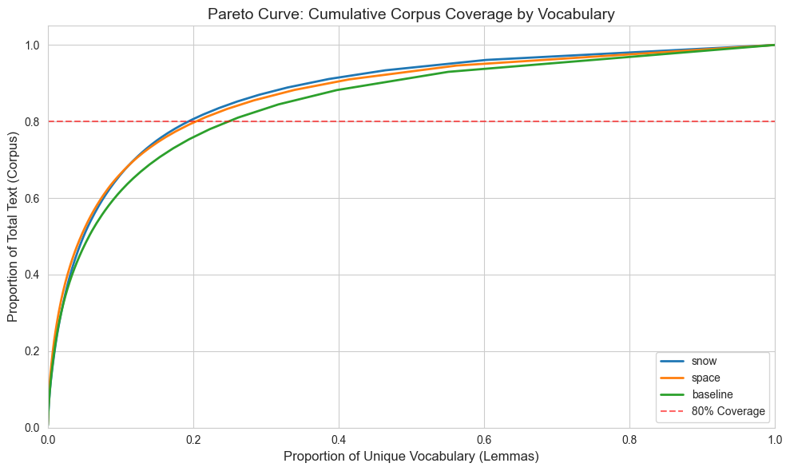

## Construction XML à partir du HTML

### Extraction des champs a partir du HTML

Pour extraire les différents champs des fichiers HTML nous avons utilisé les
chemins XPath qui permettent d'extraire les elements du DOM HTML. Pour ce faire nous utilisons etree (Element Tree) de la librairie lxml pour extraire les elements avec leur string XPath.
Cela a permis de très facilement les extraire en utilisant les outils d'inspection du browser.

Les commandes strip() et replace() sont utilisé pour eliminer les espaces, tabulations et autres caractères en début et fin de ligne, ainsi que pour extraire certaines informations comme le numero de bulletin qui est précédé tout le temps par la string "BE ..."

Dans des cas précis comme l'extraction des information de l'auteur un commande regex à été utilisée pour séparer les champs car ils avaient une strucutre bien définie.

Pour l'information de contact, la structure n'est pas bien définie donc nous ajoutons tout au XML.

### Formation du fichier XML

Nous utilisons etree de lxml pour construire le fichier html.

## Tokenisation

Separation du text selon " ", "-" et '.
Object CorpusTokeniser pour centraliser la logique en cas de changements.

## Anti-Dictionnaire

Choix de la granularité (document = article ou bulletin)

> 1 Document = 1 Article

Justification :

- Les bulletins n'ont pas vraiment de lien entre eux
- Filtrage probablement plus efficace

## Choix du seuil tf-idf

- Nous avons choisi le seuil de 0.7 de tf-idf moyen pour considérer un mot comme un stop word.
Ce seuil a été choisi après une analyse qualitative révélant que certains mots spécifiques commencent à apparaitre après ce seuil comme "laboratoire" "chercheurs" et "actualité".

- Il est a noté que ces mots restent très communs dans au vu du sujet des documents. De plus, certains mots clairement non intérréssants persistent même au dessus du seuil. Il s'agit d'un choix conservatif pour préserver au maximum les mots qui ont du sens au risk d'inclure des mots moins interressants.

#### Pourquoi sauvegarder en CSV entre les étapes ?

- Traçabilité : Tu peux vérifier chaque fichier, l’ouvrir, l’inspecter, le versionner.
- Reproductibilité : Si une étape change, tu ne recalcules pas tout depuis zéro.
- Séparation claire des tâches : Chaque fichier correspond exactement à une question du sujet.
- Compatibilité : CSV = lisible par n’importe quel outil (Excel, R, scripts bash, etc.).

## Analyse SpaCy vs SnowBall : 

Le corpus contient 14344 tokens unique avec notre méthode de séparation.

Avec le lemmatizeur SpaCy nous avons 11285 lemmes uniques;
Avec SnowBall nous avons 9046 racines uniques;
Ainsi SpaCy conserve une plus grande compléxité dans le text, chaque lemme correspond en moyenne moins de mots qu'une racine de SnowBall. 

En regardant la distribution de Pareto (% du dictonnaire nescessaire pour couvrir le x% du corpus) on peut voir la différence en distribution des différentes méthodes.
// TODO - see how to interpret better
